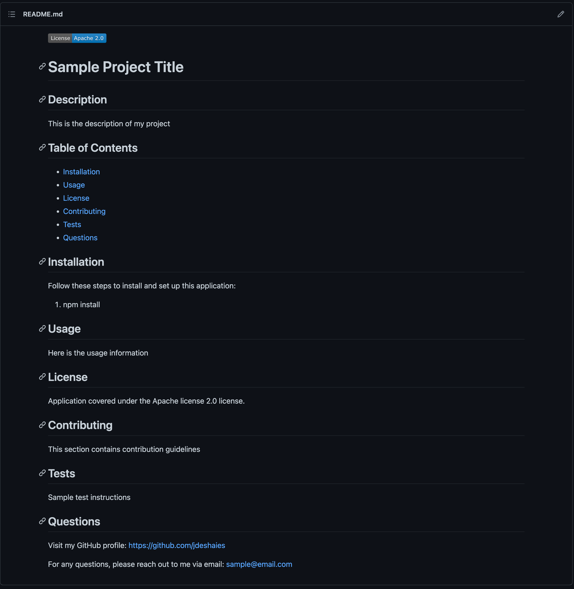

# Professional README Generator

## Description

The purpose of this project is to have a user input various pieces of information about their application and then have a professional README file generated based on this input. This project utilizes node.js so that it can be run outisde of the client's browser and so that a user does not have to interact with a UI in order to use this application. This project also uses inquirer.js as a command line for the user so that they can easily input the correct information based on the section of the README asked for. Most questions simply use the input type for the questions but the [Installation](#installation) and [License](#license) sections are unique since Installation has a default value and License includes a list of choices for the user to pick from. Another feature included with the Licence section is the display of the license badge at the top of the README file. This is done using a switch statement and chooses the correct URL based on the user input. Overall, this project makes it easy for a user to include a high-quality README file with their project in seconds.

## Table of Contents
- [Installation](#installation)
- [Usage](#usage)
- [License](#license)
- [Questions](#questions)

## Installation

In order to use this application, install the following:
1. npm init -y
2. npm install inquirer@8.2.4

## Usage

Use this application when you want to generate a professional README file for your project.

Click this link to see a video walkthrough of a sample README file generated: 
https://youtu.be/I8J67qe9VOk

## License

This application does not use any licenses currently.

## Questions

Visit my GitHub profile: https://github.com/jdeshaies

For any questions, please reach out to me via email: jd479800@gmail.com